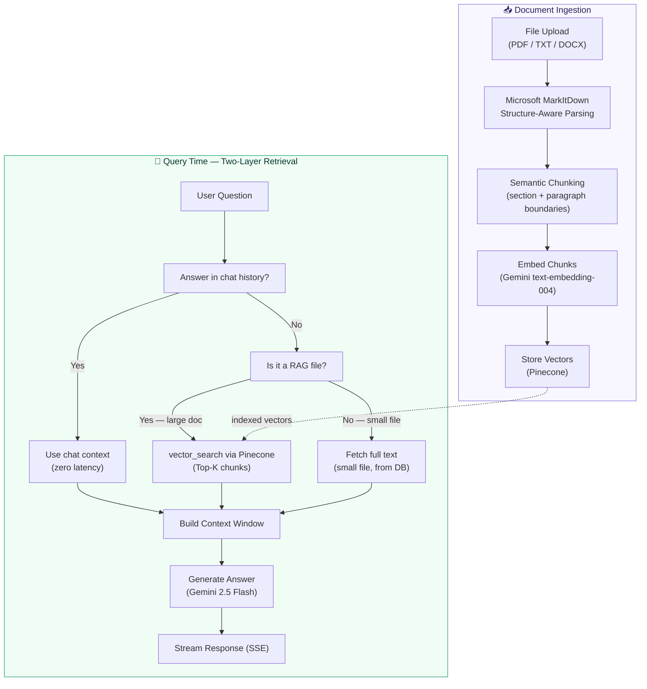
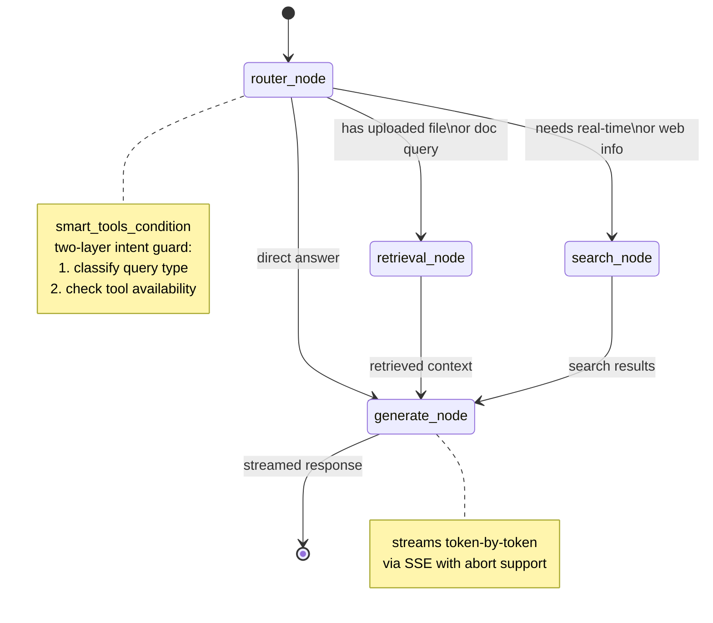

<div align="center">

<div style="display: flex; flex-direction: column; align-items: center; gap: 1rem;">
  
</div>


**A full-stack AI assistant built as a product — not a prototype.**

[](https://nextjs.org)
[](https://fastapi.tiangolo.com)
[](https://langchain-ai.github.io/langgraph)
[](https://deepmind.google/technologies/gemini)
[](https://pinecone.io)
[](LICENSE)

[Features](#features) · [Architecture](#architecture) · [Tech Stack](#tech-stack) · [Getting Started](#getting-started) · [Roadmap](#roadmap)

</div>

---

## What is Alfred?

Alfred is an AI assistant designed from the ground up to work **as a personal AI agent.**

Most agents are easy to build. A few API calls, a prompt, a tool or two. Alfred is built around the harder problems: streaming that doesn't drop, a RAG pipeline that retrieves the right thing on follow-up questions, and a long-term memory system that actually remembers who you are.

The architecture was designed before a single line was written — validated against real engineering approaches from production systems, not just tutorials.

---

## Features

| Capability | Description |
|---|---|
| 🔍 **RAG Pipeline** | Upload any file. Ask anything about it. Structure-aware chunking via Microsoft MarkItDown preserves document semantics. Two-layer retrieval decides whether to use chat context or run vector search. |
| 🧠 **Long-Term Memory** | LLM Wiki-based global memory system. Alfred remembers your projects, preferences, and decisions across all sessions — with relevancy decay and automated pruning. |
| 🌐 **Live Web Search** | Real-time answers via Tavily. Alfred decides autonomously when to search vs answer from context. |
| 🖼️ **Image Recognition** | Drop a screenshot, diagram, or photo. Alfred understands and responds to visual content. |
| 📊 **Chart Generation** | Describe data or ask for a visualization — get a rendered Chart.js graph inline. |
| 🔀 **Flowchart Generation** | Ask for a diagram — Alfred generates and renders Mermaid diagrams inside the chat. |
| ⚡ **SSE Streaming** | Token-by-token streaming with full abort support. No polling, no WebSocket overhead. |
| 📁 **Drag & Drop Upload** | File upload with drag-and-drop UI, supporting documents, images, and more. |
| 🛠️ **Live Tool Display** | Real-time visibility into which tools Alfred is using as it reasons. |

---

## Architecture

### System Overview


---

### RAG Pipeline

Alfred's RAG pipeline has two layers of intelligence — one for parsing, one for retrieval.

#### Layer 1 — Structure-Aware Chunking (Microsoft MarkItDown)

Files are not split by character count. They are first converted to clean Markdown using **Microsoft MarkItDown**, which preserves document structure — headings, tables, lists, and code blocks stay intact. Chunks are then split along semantic boundaries (sections, paragraphs) rather than arbitrary token limits. This means a chunk always contains a complete idea, not half a sentence.

#### Layer 2 — Two-Memory Retrieval

When a user asks about an uploaded document, Alfred doesn't blindly run vector search every time. It uses a **two-layer retrieval decision**:

```
User asks about a document
        │
        ▼
Is the answer already in chat history?
        │
   Yes ─┘── Use chat context directly (no vector search, zero latency)
        │
   No ──┘── Is it a RAG file (large doc, needs_rag=True)?
                │
           Yes ─┘── Run vector_search via Pinecone (top-k chunks)
                │
           No ──┘── Fetch full text directly from DB (small file)
```

This means Alfred never wastes a Pinecone query when the answer is already sitting in the conversation. Vector search only fires when it genuinely needs to.



---

### LangGraph State Machine



---

### 🧠 Global Memory — LLM Wiki Based

> Inspired by **Andrej Karpathy's LLM Wiki** idea (OpenAI co-founder, former Tesla AI Director) — extended into a per-user, multi-page, dynamic long-term memory system.

Alfred remembers who you are across every session. Not just the current conversation — your projects, preferences, tech stack, and past decisions, permanently.

#### Architectures Considered

| Architecture | Accuracy | Token Efficiency | Latency | Decision |
|---|---|---|---|---|
| Full context injection | ⭐⭐⭐ | ⭐ | ⭐⭐⭐⭐⭐ | ❌ Rejected |
| Vector RAG (Pinecone) | ⭐⭐⭐⭐ | ⭐⭐⭐⭐ | ⭐⭐ | ❌ Rejected |
| **LLM Wiki (current)** | ⭐⭐⭐⭐ | ⭐⭐⭐⭐⭐ | ⭐⭐⭐⭐⭐ | ✅ Chosen |

**Full context injection** — dumps everything into the system prompt every turn. Zero latency, but completely unscalable. 20 wiki pages = 5000+ tokens wasted on every single message, even "what's the weather?"

**Vector RAG** — embeddings + cosine similarity on every turn. Accurate, but adds an API call and vector search to every message. Overkill for small memory sets. Karpathy himself noted this is unnecessary at lower scale. Also risks surfacing semantically similar but contextually irrelevant old memories.

**LLM Wiki** — chosen because it only loads what's needed, retrieval is a fast DB query with no embeddings, and the LLM describes intent in natural language while Python does the matching.

> Vector search is planned as a future upgrade when a user's memory grows beyond 20+ pages. The current architecture is designed to swap the retrieval backend without changing the LLM interface.

#### How Memory Flows

```
┌─────────────────────────────────────────────────────────────────┐
│                     ALFRED WIKI MEMORY                          │
├──────────────────┬──────────────────┬───────────────────────────┤
│     INGEST       │      READ        │         PRUNE             │
│                  │                  │                           │
│  Session ends    │  User message    │   Background job (3 AM)   │
│       │          │       │          │          │                 │
│  Summarizer LLM  │  Router node     │  Fetch all user pages     │
│  compresses conv │  fetches wiki    │          │                 │
│       │          │  index + scores  │  score = today −          │
│  Page exists?    │       │          │  last_accessed (days)     │
│  ┌────┴────┐     │  Wiki map        │          │                 │
│ No       Yes     │  injected into   │    score > 30?            │
│  │         │     │  system prompt   │   ┌──────┴──────┐         │
│ Create   Update  │       │          │  Yes            No        │
│  page    page    │  LLM picks topic │   │              │         │
│  score=0 reset   │  lowest score    │  Delete        Keep       │
│  └────┬────┘     │  = most recent   │  page          active     │
│       │          │       │          │                           │
│  MongoDB wiki    │  wiki_search()   │                           │
│  store           │  plain English   │                           │
│                  │  → keyword match │                           │
│                  │       │          │                           │
│                  │  Fast DB query   │                           │
│                  │  no embeddings   │                           │
│                  │       │          │                           │
│                  │  Page returned   │                           │
│                  │  score → 0       │                           │
│                  │       │          │                           │
│                  │  LLM responds    │                           │
└──────────────────┴──────────────────┴───────────────────────────┘
```

#### Relevancy Decay

Every wiki page has a score: `score = today − date of last access (days)`

| Score | Status | Action |
|---|---|---|
| 0 | Just accessed | Highest priority in wiki map |
| 1–14 | Active | Included normally |
| 15–29 | Aging | Flagged for compression (planned) |
| 30+ | Stale | Pruned at 3 AM cleanup |

When the LLM reads a page, score resets to `0`. When topics are ambiguous, the LLM picks the page with the **lowest score** — most recently relevant wins.

#### The wiki_search Tool

The LLM never has to remember or copy exact slugs. It describes what it needs in plain English and Python does the matching:

```python
# LLM calls:
wiki_search("metro mate project details")
wiki_search("user's name and background")

# Python scores each page by keyword overlap across:
# title + slug + category + content[:400]
# Returns top 1-2 matching pages
```

**Why not slug-based lookup?** The previous approach gave the LLM an exact slug list and asked it to copy the right one. Gemini generated `"metro-mate-project"` instead of `"metro-mate"`. LLMs generate — they don't copy. `wiki_search` fixes this permanently.

#### Memory Stack

| Layer | Storage | What it holds | Scope |
|---|---|---|---|
| **Wiki** | MongoDB | Long-term personal facts, projects, preferences | Permanent (with decay) |
| **RAG** | Pinecone | Uploaded file content | Per-file |
| **Checkpointer** | MongoDB | Live conversation history | Per-thread |

#### Roadmap for Memory

- [x] Wiki store with slug + category + content
- [x] `wiki_search` natural language retrieval
- [x] Relevancy score decay system
- [x] Summarizer layer on session end
- [ ] 3 AM pruning cron job (APScheduler)
- [ ] Two-tier decay — compress at 15 days, delete at 30
- [ ] Redis inactivity trigger for auto-summarizer
- [ ] Semantic search via Pinecone when memory exceeds 20+ pages

---

## Tech Stack

### Frontend
| Layer | Technology |
|---|---|
| Framework | Next.js 15 (App Router) |
| State Management | Zustand + Immer |
| Styling | Tailwind CSS + shadcn/ui |
| Animations | Framer Motion |
| Streaming | `@microsoft/fetch-event-source` |
| Rendering | react-markdown · react-syntax-highlighter · Mermaid · Chart.js |

### Backend
| Layer | Technology |
|---|---|
| Framework | FastAPI |
| Agent Orchestration | LangGraph (state machine) |
| LLM | Gemini 2.5 Flash (inference + vision) |
| Embeddings | Gemini `text-embedding-004` |
| Document Parsing | Microsoft MarkItDown (structure-aware) |
| Vector Store | Pinecone |
| Web Search | Tavily |
| Database | MongoDB |
| Checkpointer | `AsyncMongoDBSaver` (LangGraph) |
| Streaming | `StreamingResponse` (SSE) |

---

## Getting Started

### Prerequisites
- Node.js 18+
- Python 3.11+
- Pinecone account
- MongoDB instance
- Google AI API key (Gemini)
- Tavily API key

### Backend

```bash
cd backend
python -m venv venv
source venv/bin/activate        # Windows: venv\Scripts\activate
pip install -r requirements.txt

# copy and fill in your keys
cp .env.example .env

uvicorn main:app --reload
```

### Frontend

```bash
cd frontend
npm install
cp .env.example .env.local
npm run dev
```

### Environment Variables

```env
# backend/.env
GOOGLE_API_KEY=
PINECONE_API_KEY=
PINECONE_INDEX_NAME=
TAVILY_API_KEY=
MONGODB_URI=                    # MongoDB connection string

# frontend/.env.local
NEXT_PUBLIC_API_URL=http://localhost:8000
```

---

## Roadmap

- [x] RAG pipeline with structure-aware chunking (MarkItDown)
- [x] Two-layer retrieval (chat context → vector search fallback)
- [x] Live web search with autonomous routing
- [x] Image recognition (Gemini Vision)
- [x] Mermaid diagram generation
- [x] Chart.js graph generation
- [x] SSE streaming with abort support
- [x] LLM Wiki global memory with relevancy decay
- [x] Drag & drop file upload
- [ ] 3 AM memory pruning cron job
- [ ] Redis inactivity trigger for auto-summarizer
- [ ] Semantic memory search via Pinecone (20+ pages)
- [ ] GitHub integration (PR review, repo Q&A)
- [ ] Multi-model switching
- [ ] VS Code extension
- [ ] Google Suite via MCP connectors
- [ ] Voice input (Whisper fine-tuned on Haryanvi dialect)

---

## Why Alfred is Different

Most AI assistants are built to demo well. Alfred is built to work well.

The architecture was designed before any code was written — structure first, implementation second. Approaches were validated against production engineering patterns, not just quickstart guides.

AI was used as a tool in this process — to validate thinking, challenge approaches, and accelerate implementation. The decisions were made by a human who understood the tradeoffs.

---

<div align="center">

Built by [Shivansh Sharma](https://github.com/Shivanshxsharma) · NSUT Delhi

⭐ Star this repo if you find it useful

</div>
