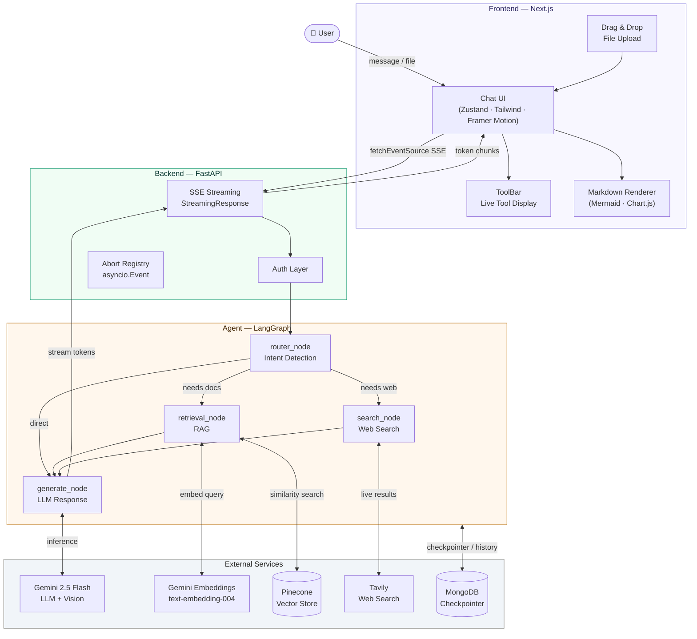
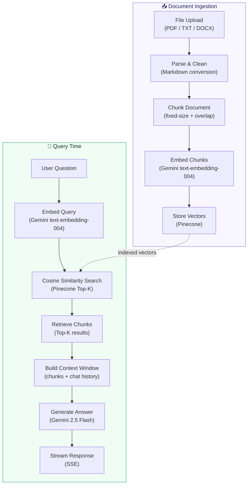
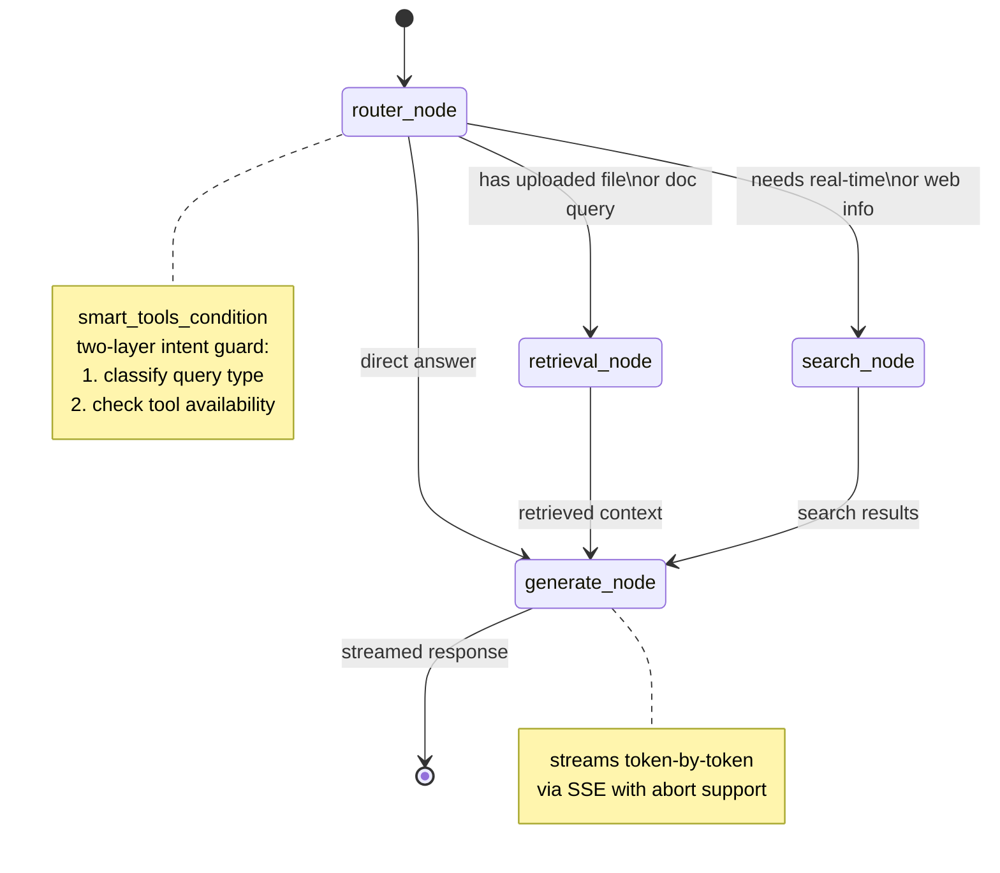

<div align="center">


# 🎩 Alfred

**A full-stack AI assistant built as a product — not a prototype.**

[](https://nextjs.org)
[](https://fastapi.tiangolo.com)
[](https://langchain-ai.github.io/langgraph)
[](https://deepmind.google/technologies/gemini)
[](https://pinecone.io)
[](LICENSE)

[Features](#features) · [Architecture](#architecture) · [Tech Stack](#tech-stack) · [Getting Started](#getting-started) · [Roadmap](#roadmap)

</div>

---

## What is Alfred?

Alfred is an AI assistant designed from the ground up to work **as a personal ai agent** 

Most agents are easy to build. A few API calls, a prompt, a tool or two. Alfred is built around the harder problems: streaming that doesn't drop, a RAG pipeline that retrieves the right thing on follow-up questions, response times that stay consistent, and a state machine that handles complex multi-step reasoning without breaking.

The architecture was designed before a single line was written — validated against real engineering approaches from production systems, not just tutorials.

---

## Features

| Capability | Description |
|---|---|
| 🔍 **RAG Pipeline** | Upload any file. Ask anything about it. Retrieves accurate context even across follow-up questions. |
| 🌐 **Live Web Search** | Real-time answers via Tavily. Alfred decides autonomously when to search vs answer from context. |
| 🖼️ **Image Recognition** | Drop a screenshot, diagram, or photo. Alfred understands and responds to visual content. |
| 📊 **Chart Generation** | Describe data or ask for a visualization — gets a rendered Chart.js graph inline. |
| 🔀 **Flowchart Generation** | Ask for a diagram — Alfred generates and renders Mermaid diagrams inside the chat. |
| ⚡ **SSE Streaming** | Token-by-token streaming with full abort support. No polling, no WebSocket overhead. |
| 📁 **Drag & Drop Upload** | File upload with drag-and-drop UI, supporting documents, images, and more. |
| 🛠️ **Live Tool Display** | Real-time visibility into which tools Alfred is using as it reasons. |

---

## Architecture

### System Overview



---

### RAG Pipeline



---

### LangGraph State Machine



---

## Tech Stack

### Frontend
| Layer | Technology |
|---|---|
| Framework | Next.js 15 (App Router) |
| State Management | Zustand + Immer |
| Styling | Tailwind CSS + shadcn/ui |
| Animations | Framer Motion |
| Streaming | `@microsoft/fetch-event-source` |
| Rendering | react-markdown · react-syntax-highlighter · Mermaid · Chart.js |

### Backend
| Layer | Technology |
|---|---|
| Framework | FastAPI |
| Agent Orchestration | LangGraph (state machine) |
| LLM | Gemini 2.5 Flash (inference + vision) |
| Embeddings | Gemini `text-embedding-004` |
| Vector Store | Pinecone |
| Web Search | Tavily |
| Database | MongoDB |
| Checkpointer | `AsyncMongoDBSaver` (LangGraph) |
| Streaming | `StreamingResponse` (SSE) |

---


## Getting Started

### Prerequisites
- Node.js 18+
- Python 3.11+
- Pinecone account
- MongoDB instance
- Google AI API key (Gemini)
- Tavily API key

### Backend

```bash
cd backend
python -m venv venv
source venv/bin/activate        # Windows: venv\Scripts\activate
pip install -r requirements.txt

# copy and fill in your keys
cp .env.example .env

uvicorn main:app --reload
```

### Frontend

```bash
cd frontend
npm install
cp .env.example .env.local
npm run dev
```

### Environment Variables

```env
# backend/.env
GOOGLE_API_KEY=
PINECONE_API_KEY=
PINECONE_INDEX_NAME=
TAVILY_API_KEY=
MONGODB_URI=                    # MongoDB connection string

# frontend/.env.local
NEXT_PUBLIC_API_URL=http://localhost:8000
```

---

## Roadmap

- [x] RAG pipeline with follow-up query support
- [x] Live web search with autonomous routing
- [x] Image recognition (Gemini Vision)
- [x] Mermaid diagram generation
- [x] Chart.js graph generation
- [x] SSE streaming with abort support
- [x] Two-layer memory architecture
- [x] Drag & drop file upload
- [ ] GitHub integration (PR review, repo Q&A)
- [ ] Multi-model switching
- [ ] VS Code extension
- [ ] Google Suite via MCP connectors
- [ ] Voice input (Whisper fine-tuned on Haryanvi dialect)

---

## Why Alfred is Different

Most AI assistants are built to demo well. Alfred is built to work well.

The architecture was designed before any code was written — structure first, implementation second. Approaches were validated against production engineering patterns, not just quickstart guides. Every architectural decision (SSE over WebSockets, Pinecone over Atlas Vector Search, LangGraph state machine over simple chains) has a reason behind it.

AI was used as a tool in this process — to validate thinking, challenge approaches, and accelerate implementation. The decisions were made by a human who understood the tradeoffs.

---

<div align="center">

Built by [Shivansh Sharma](https://github.com/Shivanshxsharma) · NSUT Delhi

⭐ Star this repo if you find it useful

</div>
