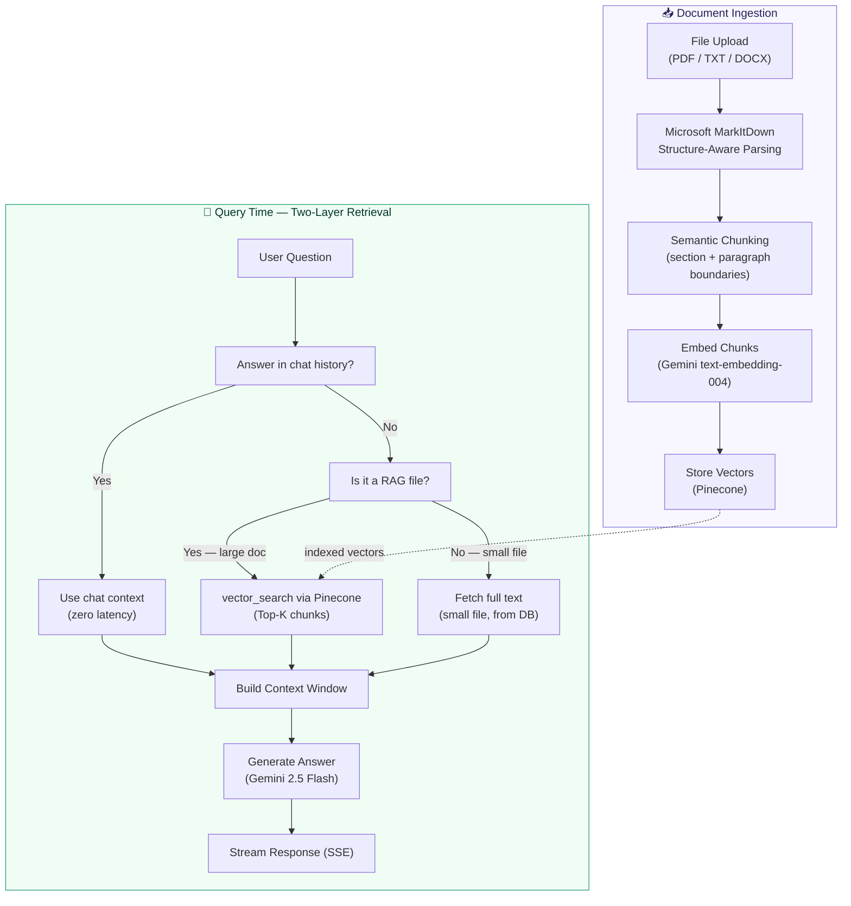
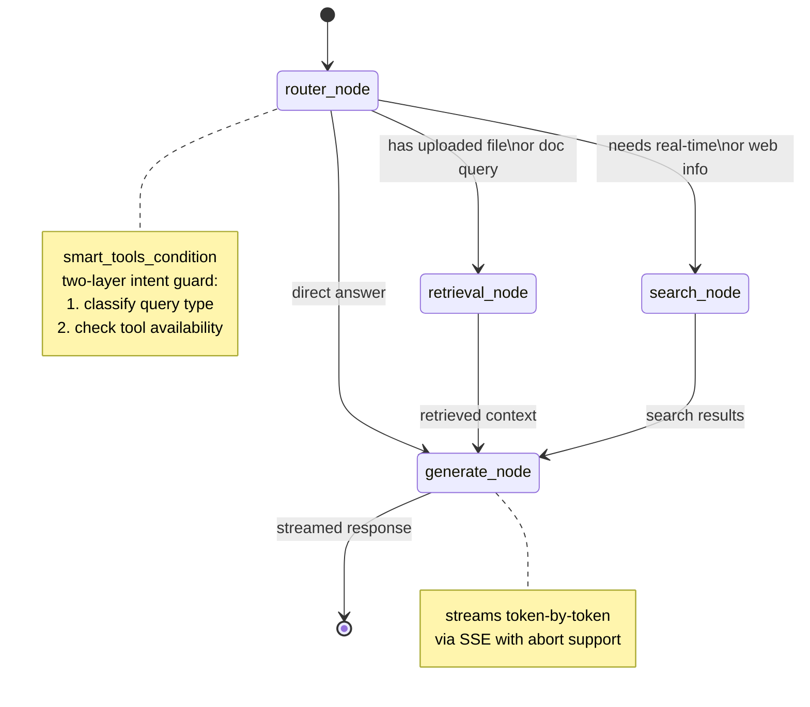
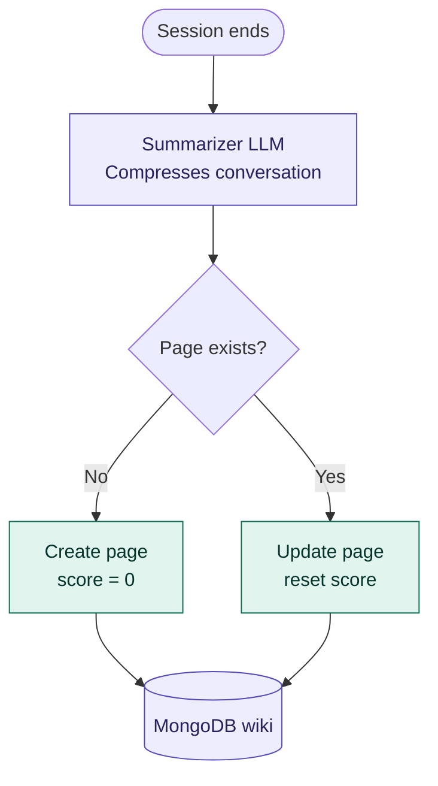
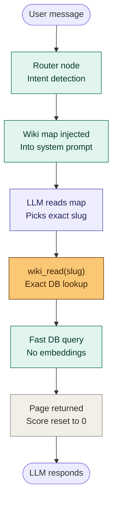
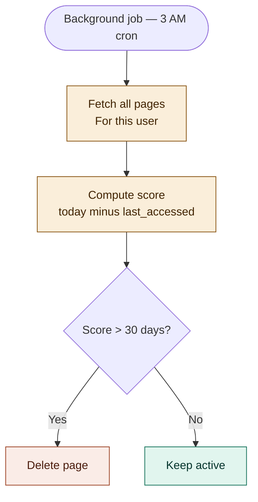

<div align="center">
<?xml version="1.0" encoding="UTF-8"?>


<div style="display: flex; flex-direction: column; justify-items:center; align-items: center; gap: 1rem;">
  <svg version="1.1" xmlns="http://www.w3.org/2000/svg" width="240" height="100">
<path d="M0 0 C264 0 528 0 800 0 C800 60.06 800 120.12 800 182 C536 182 272 182 0 182 C0 121.94 0 61.88 0 0 Z " fill="#0D1117" transform="translate(0,0)"/>
<path d="M0 0 C10.23 0 20.46 0 31 0 C31 57.09 31 114.18 31 173 C20.77 173 10.54 173 0 173 C0 169.37 0 165.74 0 162 C-1.00160156 162.47050781 -2.00320313 162.94101563 -3.03515625 163.42578125 C-4.37757618 164.05474723 -5.72002568 164.68365011 -7.0625 165.3125 C-7.71927734 165.62123047 -8.37605469 165.92996094 -9.05273438 166.24804688 C-11.0312843 167.17396926 -13.01516352 168.08764552 -15 169 C-16.72476563 169.804375 -16.72476563 169.804375 -18.484375 170.625 C-38.69212358 178.528475 -62.18086063 176.47558596 -82.0234375 168.8359375 C-84.47745075 167.69795659 -86.71462709 166.4456865 -89 165 C-89.89847656 164.43667969 -90.79695312 163.87335938 -91.72265625 163.29296875 C-105.43150175 154.03431244 -114.49144575 140.1558967 -118 124 C-118.4491618 119.74124234 -118.52474456 115.53018182 -118.5 111.25 C-118.49427979 110.10200928 -118.48855957 108.95401855 -118.48266602 107.77124023 C-118.29664539 98.92805786 -117.20620042 91.90126762 -113 84 C-112.22076172 82.53433594 -112.22076172 82.53433594 -111.42578125 81.0390625 C-105.12448793 70.31658202 -96.69932828 63.12765128 -86 57 C-85.03513672 56.41605469 -85.03513672 56.41605469 -84.05078125 55.8203125 C-77.575347 52.19631676 -70.1622081 50.70834303 -63 49 C-61.84757813 48.70609375 -61.84757813 48.70609375 -60.671875 48.40625 C-49.21542949 46.66433431 -36.95000303 47.3981043 -25.625 49.625 C-24.89144287 49.76510498 -24.15788574 49.90520996 -23.40209961 50.04956055 C-15.19541507 51.844521 -8.03071565 54.98848163 0 58 C0 38.86 0 19.72 0 0 Z " fill="#6B27D6" transform="translate(760,4)"/>
<path d="M0 0 C4.09381231 3.94977076 7.21601122 8.17568662 10 13.125 C10.44085938 13.888125 10.88171875 14.65125 11.3359375 15.4375 C20.85395838 33.89669201 19.54830344 55.41990761 19.33294678 75.5715332 C19.30532298 78.59910133 19.29707327 81.62659447 19.28938007 84.65426922 C19.27946161 88.27346238 19.25961969 91.89257749 19.23828125 95.51171875 C19.2348855 96.19848883 19.23148975 96.8852589 19.2279911 97.59284019 C19.21648573 99.51595434 19.19696019 101.43901555 19.17700195 103.36206055 C19.16223564 105.00032051 19.16223564 105.00032051 19.14717102 106.67167664 C19 109.125 19 109.125 18 110.125 C15.78144736 110.21283542 13.56011504 110.23194609 11.33984375 110.22265625 C10.34314415 110.22053383 10.34314415 110.22053383 9.3263092 110.21836853 C7.19666101 110.21275518 5.06711661 110.20020054 2.9375 110.1875 C1.49674631 110.18248671 0.05599097 110.17792351 -1.38476562 110.17382812 C-4.92321102 110.16278145 -8.46159539 110.14550792 -12 110.125 C-12 106.495 -12 102.865 -12 99.125 C-13.4540625 99.81335938 -13.4540625 99.81335938 -14.9375 100.515625 C-24.46847001 104.91979741 -33.73356878 107.97445283 -44 110.125 C-44.95648438 110.35058594 -45.91296875 110.57617188 -46.8984375 110.80859375 C-65.70276493 114.71493684 -88.43876793 113.62652726 -105 103.125 C-105.77730469 102.63386719 -106.55460937 102.14273438 -107.35546875 101.63671875 C-114.79250637 96.41708933 -121.10164491 88.47846031 -122.7890625 79.34765625 C-123.8227617 68.45552948 -123.40438085 59.55973402 -116.9375 50.5 C-107.23247483 38.81727012 -92.79852496 33.56710417 -78 32.125 C-62.28197544 31.26954292 -46.59951204 32.15589802 -31 34.125 C-30.31502441 34.21040039 -29.63004883 34.29580078 -28.92431641 34.38378906 C-23.30908358 35.10605104 -18.21553139 35.85737766 -13 38.125 C-14.52810671 29.56760241 -18.14171131 23.90782198 -25.25 18.8125 C-33.13667289 13.47829683 -41.99159722 12.66571342 -51.25 12.875 C-52.76932129 12.89687378 -52.76932129 12.89687378 -54.31933594 12.91918945 C-57.21363407 12.96983273 -60.10638372 13.04526714 -63 13.125 C-64.9490625 13.15400391 -64.9490625 13.15400391 -66.9375 13.18359375 C-77.57946682 13.59772689 -89.00516284 16.07995962 -98.80859375 20.34765625 C-101.44193441 21.28176461 -102.43646761 21.18529267 -105 20.125 C-106.08081055 18.23901367 -106.08081055 18.23901367 -106.88671875 15.79296875 C-107.18513672 14.91189453 -107.48355469 14.03082031 -107.79101562 13.12304688 C-108.08685547 12.19556641 -108.38269531 11.26808594 -108.6875 10.3125 C-109.14866211 8.93868164 -109.14866211 8.93868164 -109.61914062 7.53710938 C-110.87714276 3.75759749 -112.07446541 0.00091901 -113 -3.875 C-103.77664337 -7.42136661 -94.76363436 -10.20103729 -85 -11.875 C-84.22720703 -12.01180176 -83.45441406 -12.14860352 -82.65820312 -12.28955078 C-55.0288771 -17.04269511 -22.89603856 -19.12447813 0 0 Z " fill="#6B27D6" transform="translate(131,66.875)"/>
<path d="M0 0 C11.60584252 10.31630446 18.20923624 23.17964805 21.4609375 38.1875 C21.4609375 44.4575 21.4609375 50.7275 21.4609375 57.1875 C-16.4890625 57.1875 -54.4390625 57.1875 -93.5390625 57.1875 C-88.36614187 67.53334127 -81.98108041 73.4931162 -70.95703125 77.484375 C-51.67441233 83.15210964 -31.73449954 82.88486908 -12.5390625 77.1875 C-10.35225577 76.60157308 -8.16484408 76.01789448 -5.9765625 75.4375 C-4.49649393 75.02404845 -3.01690774 74.60882953 -1.5390625 74.1875 C-0.43230631 76.3737225 0.67138128 78.56140948 1.7734375 80.75 C2.08216797 81.35908203 2.39089844 81.96816406 2.70898438 82.59570312 C8.4609375 94.0390625 8.4609375 94.0390625 8.4609375 98.1875 C6.58709847 98.98191072 4.71180864 99.77289974 2.8359375 100.5625 C1.79179688 101.00335938 0.74765625 101.44421875 -0.328125 101.8984375 C-27.35583539 112.74897817 -61.75430967 113.35043327 -88.64648438 101.98022461 C-103.83575836 95.26826069 -117.32607327 85.37353411 -124.0546875 69.64453125 C-129.80703238 53.95782065 -130.95463254 37.87474103 -124.5390625 22.1875 C-124.22324219 21.341875 -123.90742188 20.49625 -123.58203125 19.625 C-116.60767404 3.32537865 -101.05467558 -6.99220168 -85.2890625 -13.4375 C-56.78259558 -23.97743373 -23.91419299 -18.3844847 0 0 Z " fill="#6B27D6" transform="translate(596.5390625,69.8125)"/>
<path d="M0 0 C-0.93426799 5.22498023 -2.75268435 9.85217081 -4.75 14.75 C-5.25273437 16.06291016 -5.25273437 16.06291016 -5.765625 17.40234375 C-8.32754233 23.66157359 -8.32754233 23.66157359 -11.390625 25.203125 C-14.50887231 24.96038719 -17.05199524 24.03366749 -20 23 C-28.93004741 22.14688133 -36.67876527 22.44698478 -43.8125 28.3125 C-48.50826077 34.08157752 -49.32404991 38.45822459 -51 46 C-38.13 46 -25.26 46 -12 46 C-12 53.59 -12 61.18 -12 69 C-24.87 69 -37.74 69 -51 69 C-51 102 -51 135 -51 169 C-61.23 169 -71.46 169 -82 169 C-82 136 -82 103 -82 69 C-88.93 69 -95.86 69 -103 69 C-103 61.41 -103 53.82 -103 46 C-96.07 46 -89.14 46 -82 46 C-82.103125 44.515 -82.20625 43.03 -82.3125 41.5 C-82.25973617 27.851756 -76.67365223 15.68947419 -67.10546875 6.1015625 C-62.29094068 1.80100365 -57.27125081 -1.09753545 -51.125 -3.125 C-50.13757813 -3.45757812 -49.15015625 -3.79015625 -48.1328125 -4.1328125 C-34.28605322 -7.96570597 -12.41492545 -8.27661697 0 0 Z " fill="#6B27D5" transform="translate(356,8)"/>
<path d="M0 0 C10.23 0 20.46 0 31 0 C31 57.09 31 114.18 31 173 C20.77 173 10.54 173 0 173 C0 115.91 0 58.82 0 0 Z " fill="#6A27D4" transform="translate(191,4)"/>
<path d="M0 0 C0.88429688 0.21140625 1.76859375 0.4228125 2.6796875 0.640625 C10.4712165 2.80339817 17.29151258 6.52767506 24 11 C24.42132568 12.86381531 24.42132568 12.86381531 24.48339844 15.1550293 C24.52663239 16.44228157 24.52663239 16.44228157 24.57073975 17.75553894 C24.58348938 18.68570328 24.59623901 19.61586761 24.609375 20.57421875 C24.62647522 21.53141312 24.64357544 22.48860748 24.66119385 23.47480774 C24.68956948 25.50483228 24.70915611 27.53499554 24.72070312 29.56518555 C24.74974083 32.65987878 24.84269438 35.74851666 24.9375 38.84179688 C25.17002573 53.22571855 25.17002573 53.22571855 22.11474609 57.85888672 C19.78685074 59.69969396 17.72747314 60.85487979 15 62 C13.37205275 62.91142226 11.74668592 63.82748303 10.125 64.75 C-2.78221507 70.84284687 -20.44907654 73.84744967 -34.48828125 70.05859375 C-37.44229558 68.86122326 -40.20479761 67.528891 -43 66 C-43.74765625 65.62746094 -44.4953125 65.25492187 -45.265625 64.87109375 C-52.99961004 60.63511339 -58.41396834 53.16196455 -61.328125 44.91796875 C-63.95732616 33.49928695 -62.28797775 24.75772802 -56.82421875 14.59765625 C-55 12 -55 12 -52 11 C-52 10.34 -52 9.68 -52 9 C-37.88638973 -3.93482115 -17.69872906 -4.5786225 0 0 Z " fill="#0D1118" transform="translate(736,81)"/>
<path d="M0 0 C1.17908109 3.39165005 2.34103966 6.78892712 3.5 10.1875 C3.83386719 11.14720703 4.16773438 12.10691406 4.51171875 13.09570312 C4.82753906 14.02705078 5.14335937 14.95839844 5.46875 15.91796875 C5.90864258 17.19837036 5.90864258 17.19837036 6.35742188 18.50463867 C7.02681173 21.10411957 7.11719018 23.32764529 7 26 C5.90042969 26.24234375 4.80085938 26.4846875 3.66796875 26.734375 C-10.41834745 29.90032366 -24.72943388 33.49045984 -36 43 C-36.66 43 -37.32 43 -38 43 C-38.33 43.99 -38.66 44.98 -39 46 C-40.24803658 47.10259407 -40.24803658 47.10259407 -41.52128601 48.22746277 C-44.70524095 51.78883921 -44.63527342 53.63516593 -44.65942383 58.3605957 C-44.67514938 59.44433723 -44.67514938 59.44433723 -44.69119263 60.54997253 C-44.71987472 62.92568265 -44.71365989 65.29992949 -44.70703125 67.67578125 C-44.72015058 69.32775188 -44.73545553 70.97970647 -44.75285339 72.63163757 C-44.79268945 76.9701484 -44.80289289 81.30823948 -44.80688477 85.64691162 C-44.8162189 90.0778882 -44.85363416 94.50861843 -44.88867188 98.93945312 C-44.95323378 107.62634862 -44.98388875 116.31287938 -45 125 C-55.23 125 -65.46 125 -76 125 C-76 84.41 -76 43.82 -76 2 C-65.77 2 -55.54 2 -45 2 C-45 7.61 -45 13.22 -45 19 C-43.98421875 18.34773438 -42.9684375 17.69546875 -41.921875 17.0234375 C-11.17585696 -2.56608254 -11.17585696 -2.56608254 0 0 Z " fill="#6B27D5" transform="translate(443,52)"/>
<path d="M0 0 C1.26457031 0.24121582 1.26457031 0.24121582 2.5546875 0.48730469 C8.38076567 1.60723358 14.19294186 2.78552896 20 4 C20.3354811 9.48969072 20.3354811 9.48969072 18.890625 11.6875 C4.73824299 23.00940561 -11.70495013 27.42240167 -29.5 27.5 C-30.59779785 27.50628418 -31.6955957 27.51256836 -32.82666016 27.51904297 C-42.39587055 27.36886338 -50.09276205 25.90723795 -57 19 C-58.3564588 14.9306236 -58.65109048 11.25079759 -58 7 C-47.0217026 -8.30308122 -15.92321393 -3.04414384 0 0 Z " fill="#0E111A" transform="translate(99,125)"/>
<path d="M0 0 C5.63729347 4.12323551 10.73321597 8.7634123 14 15 C14 15.99 14 16.98 14 18 C-13.06 18 -40.12 18 -68 18 C-66.42414286 10.12071429 -62.53905832 5.74098712 -55.9375 1.25 C-39.13855542 -8.56435666 -17.04462666 -10.12736627 0 0 Z " fill="#0E111A" transform="translate(571,85)"/>
</svg>
</div>


**A full-stack AI assistant built as a product — not a prototype.**

[](https://nextjs.org)
[](https://fastapi.tiangolo.com)
[](https://langchain-ai.github.io/langgraph)
[](https://deepmind.google/technologies/gemini)
[](https://pinecone.io)
[](LICENSE)

[Features](#features) · [Architecture](#architecture) · [Tech Stack](#tech-stack) · [Getting Started](#getting-started) · [Roadmap](#roadmap)

</div>

---

## What is Alfred?

Alfred is an AI assistant designed from the ground up to work **as a personal AI agent.**

Most agents are easy to build. A few API calls, a prompt, a tool or two. Alfred is built around the harder problems: streaming that doesn't drop, a RAG pipeline that retrieves the right thing on follow-up questions, and a long-term memory system that actually remembers who you are.

The architecture was designed before a single line was written — validated against real engineering approaches from production systems, not just tutorials.

---

## Features

| Capability | Description |
|---|---|
| 🔍 **RAG Pipeline** | Upload any file. Ask anything about it. Structure-aware chunking via Microsoft MarkItDown preserves document semantics. Two-layer retrieval decides whether to use chat context or run vector search. |
| 🧠 **Long-Term Memory** | LLM Wiki-based global memory system. Alfred remembers your projects, preferences, and decisions across all sessions — with relevancy decay and automated pruning. |
| 🌐 **Live Web Search** | Real-time answers via Tavily. Alfred decides autonomously when to search vs answer from context. |
| 🖼️ **Image Recognition** | Drop a screenshot, diagram, or photo. Alfred understands and responds to visual content. |
| 📊 **Chart Generation** | Describe data or ask for a visualization — get a rendered Chart.js graph inline. |
| 🔀 **Flowchart Generation** | Ask for a diagram — Alfred generates and renders Mermaid diagrams inside the chat. |
| ⚡ **SSE Streaming** | Token-by-token streaming with full abort support. No polling, no WebSocket overhead. |
| 📁 **Drag & Drop Upload** | File upload with drag-and-drop UI, supporting documents, images, and more. |
| 🛠️ **Live Tool Display** | Real-time visibility into which tools Alfred is using as it reasons. |

---

## Architecture

### System Overview


---

### RAG Pipeline

Alfred's RAG pipeline has two layers of intelligence — one for parsing, one for retrieval.

#### Layer 1 — Structure-Aware Chunking (Microsoft MarkItDown)

Files are not split by character count. They are first converted to clean Markdown using **Microsoft MarkItDown**, which preserves document structure — headings, tables, lists, and code blocks stay intact. Chunks are then split along semantic boundaries (sections, paragraphs) rather than arbitrary token limits. This means a chunk always contains a complete idea, not half a sentence.

#### Layer 2 — Two-Memory Retrieval

When a user asks about an uploaded document, Alfred doesn't blindly run vector search every time. It uses a **two-layer retrieval decision**:

```
User asks about a document
        │
        ▼
Is the answer already in chat history?
        │
   Yes ─┘── Use chat context directly (no vector search, zero latency)
        │
   No ──┘── Is it a RAG file (large doc, needs_rag=True)?
                │
           Yes ─┘── Run vector_search via Pinecone (top-k chunks)
                │
           No ──┘── Fetch full text directly from DB (small file)
```

This means Alfred never wastes a Pinecone query when the answer is already sitting in the conversation. Vector search only fires when it genuinely needs to.



---

### LangGraph State Machine



---

### 🧠 Global Memory — LLM Wiki Based

> Inspired by **Andrej Karpathy's LLM Wiki** idea (OpenAI co-founder, former Tesla AI Director) — extended into a per-user, multi-page, dynamic long-term memory system.

Alfred remembers who you are across every session. Not just the current conversation — your projects, preferences, tech stack, and past decisions, permanently.

#### Architectures Considered

| Architecture | Accuracy | Token Efficiency | Latency | Decision |
|---|---|---|---|---|
| Full context injection | ⭐⭐⭐ | ⭐ | ⭐⭐⭐⭐⭐ | ❌ Rejected |
| Vector RAG (Pinecone) | ⭐⭐⭐⭐ | ⭐⭐⭐⭐ | ⭐⭐ | ❌ Rejected |
| **LLM Wiki (current)** | ⭐⭐⭐⭐ | ⭐⭐⭐⭐⭐ | ⭐⭐⭐⭐⭐ | ✅ Chosen |

**Full context injection** — dumps everything into the system prompt every turn. Zero latency, but completely unscalable. 20 wiki pages = 5000+ tokens wasted on every single message, even "what's the weather?"

**Vector RAG** — embeddings + cosine similarity on every turn. Accurate, but adds an API call and vector search to every message. Overkill for small memory sets. Karpathy himself noted this is unnecessary at lower scale. Also risks surfacing semantically similar but contextually irrelevant old memories.

**LLM Wiki** — chosen because it only loads what's needed, retrieval is a fast DB query with no embeddings, and the LLM selects the exact page to read from a structured wiki map injected into its context.

> Vector search is planned as a future upgrade when a user's memory grows beyond 20+ pages. The current architecture is designed to swap the retrieval backend without changing the LLM interface.

#### How Memory Flows


**Ingest** — when a session ends, a Summarizer LLM compresses the conversation. If the topic already has a wiki page it's updated and score is reset; otherwise a new page is created with score 0. Everything is written to MongoDB.



**Read** — on each user message the router injects the full wiki map into the system prompt. The LLM picks the exact slug it needs and calls `wiki_read`. One fast MongoDB lookup, no embeddings, score resets to 0.



**Prune** — a background job at 3 AM computes each page's score (`today − last_accessed`). Pages stale for 30+ days are deleted; everything else stays.



When the LLM reads a page, score resets to `0`. When topics are ambiguous, the LLM picks the page with the **lowest score** — most recently relevant wins.

#### The wiki_read Tool

The LLM selects what to read using a **wiki map** injected into its context at the start of every session. The map lists every page with its slug, category, and a one-line summary:

```
Category: PROJECT
  - metro-mate: Metro Mate is a project that uses dialect training for LLMs to address language variations in a metropolitan context.
Category: USER
  - shivansh: Contains user details — key facts about Shivansh, including his identity, education, and career aspirations.
```

The LLM reads this map, picks the exact slug it needs, and calls `wiki_read` directly:

```python
# LLM calls:
wiki_read("metro-mate")
wiki_read("shivansh")

# Python fetches the page by exact slug from MongoDB
# Resets page score → 0 on access
```

**Why wiki map + exact slug?** The wiki map gives the LLM full visibility into what memory exists before it decides what to retrieve. Since slugs are shown explicitly in the map, the LLM selects from a known list rather than generating a guess — eliminating slug hallucination entirely. No embeddings, no fuzzy matching, just a fast DB lookup by slug.

#### Memory Stack

| Layer | Storage | What it holds | Scope |
|---|---|---|---|
| **Wiki** | MongoDB | Long-term personal facts, projects, preferences | Permanent (with decay) |
| **RAG** | Pinecone | Uploaded file content | Per-file |
| **Checkpointer** | MongoDB | Live conversation history | Per-thread |

#### Roadmap for Memory

- [x] Wiki store with slug + category + content
- [x] `wiki_read` with wiki map slug selection
- [x] Relevancy score decay system
- [x] Summarizer layer on session end
- [ ] 3 AM pruning cron job (APScheduler)
- [ ] Two-tier decay — compress at 15 days, delete at 30
- [ ] Redis inactivity trigger for auto-summarizer
- [ ] Semantic search via Pinecone when memory exceeds 20+ pages

---

## Tech Stack

### Frontend
| Layer | Technology |
|---|---|
| Framework | Next.js 15 (App Router) |
| State Management | Zustand + Immer |
| Styling | Tailwind CSS + shadcn/ui |
| Animations | Framer Motion |
| Streaming | `@microsoft/fetch-event-source` |
| Rendering | react-markdown · react-syntax-highlighter · Mermaid · Chart.js |

### Backend
| Layer | Technology |
|---|---|
| Framework | FastAPI |
| Agent Orchestration | LangGraph (state machine) |
| LLM | Gemini 2.5 Flash (inference + vision) |
| Embeddings | Gemini `text-embedding-004` |
| Document Parsing | Microsoft MarkItDown (structure-aware) |
| Vector Store | Pinecone |
| Web Search | Tavily |
| Database | MongoDB |
| Checkpointer | `AsyncMongoDBSaver` (LangGraph) |
| Streaming | `StreamingResponse` (SSE) |

---

## Getting Started

### Prerequisites
- Node.js 18+
- Python 3.11+
- Pinecone account
- MongoDB instance
- Google AI API key (Gemini)
- Tavily API key

### Backend

```bash
cd backend
python -m venv venv
source venv/bin/activate        # Windows: venv\Scripts\activate
pip install -r requirements.txt

# copy and fill in your keys
cp .env.example .env

uvicorn main:app --reload
```

### Frontend

```bash
cd frontend
npm install
cp .env.example .env.local
npm run dev
```

### Environment Variables

```env
# backend/.env
GOOGLE_API_KEY=
PINECONE_API_KEY=
PINECONE_INDEX_NAME=
TAVILY_API_KEY=
MONGODB_URI=                    # MongoDB connection string

# frontend/.env.local
NEXT_PUBLIC_API_URL=http://localhost:8000
```

---

## Roadmap

- [x] RAG pipeline with structure-aware chunking (MarkItDown)
- [x] Two-layer retrieval (chat context → vector search fallback)
- [x] Live web search with autonomous routing
- [x] Image recognition (Gemini Vision)
- [x] Mermaid diagram generation
- [x] Chart.js graph generation
- [x] SSE streaming with abort support
- [x] LLM Wiki global memory with relevancy decay
- [x] Drag & drop file upload
- [ ] 3 AM memory pruning cron job
- [ ] Redis inactivity trigger for auto-summarizer
- [ ] Semantic memory search via Pinecone (20+ pages)
- [ ] GitHub integration (PR review, repo Q&A)
- [ ] Multi-model switching
- [ ] VS Code extension
- [ ] Google Suite via MCP connectors
- [ ] Voice input (Whisper fine-tuned on Haryanvi dialect)

---

## Why Alfred is Different

Most AI assistants are built to demo well. Alfred is built to work well.

The architecture was designed before any code was written — structure first, implementation second. Approaches were validated against production engineering patterns, not just quickstart guides.

AI was used as a tool in this process — to validate thinking, challenge approaches, and accelerate implementation. The decisions were made by a human who understood the tradeoffs.

---

<div align="center">
