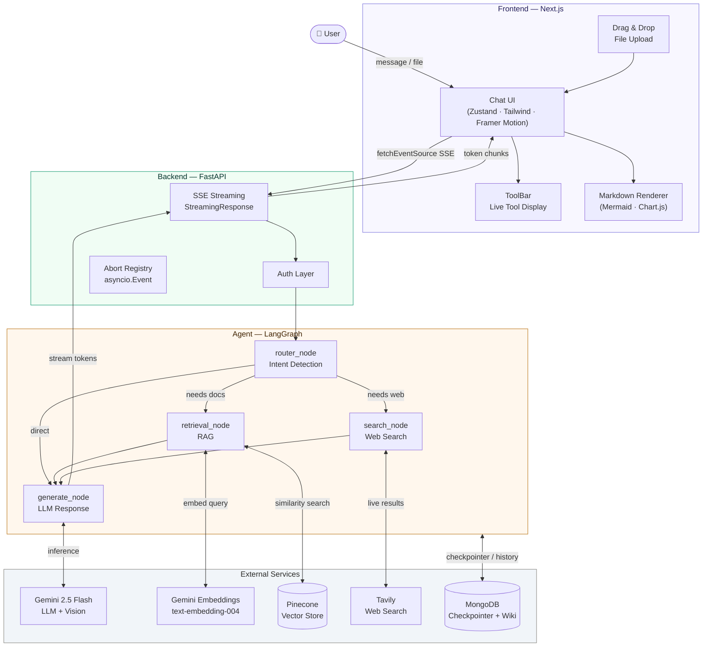
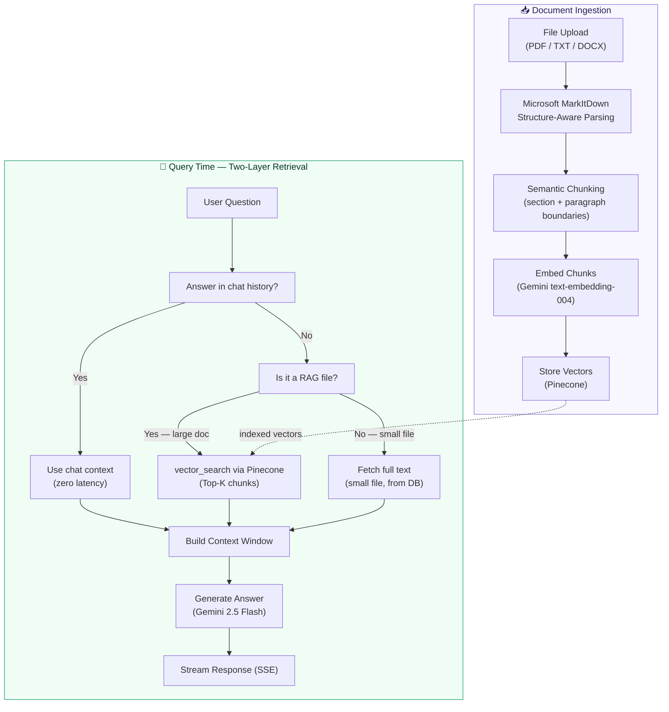
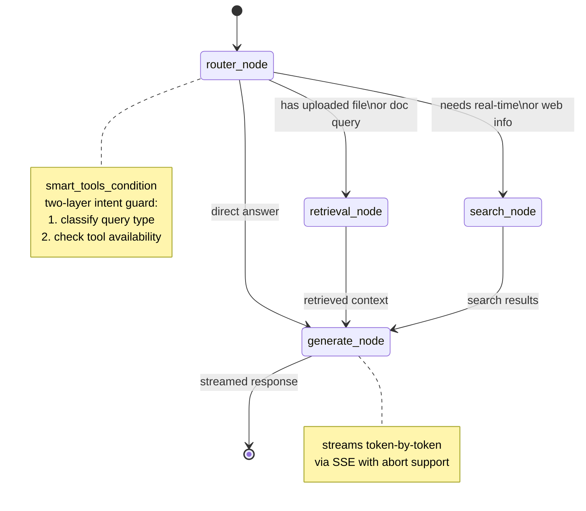

<div align="center">

<div style="display: flex; flex-direction: column; align-items: center; gap: 1rem;">
  
</div>


**A full-stack AI assistant built as a product — not a prototype.**

[](https://nextjs.org)
[](https://fastapi.tiangolo.com)
[](https://langchain-ai.github.io/langgraph)
[](https://deepmind.google/technologies/gemini)
[](https://pinecone.io)
[](LICENSE)

[Features](#features) · [Architecture](#architecture) · [Tech Stack](#tech-stack) · [Getting Started](#getting-started) · [Roadmap](#roadmap)

</div>

---

## What is Alfred?

Alfred is an AI assistant designed from the ground up to work **as a personal AI agent.**

Most agents are easy to build. A few API calls, a prompt, a tool or two. Alfred is built around the harder problems: streaming that doesn't drop, a RAG pipeline that retrieves the right thing on follow-up questions, and a long-term memory system that actually remembers who you are.

The architecture was designed before a single line was written — validated against real engineering approaches from production systems, not just tutorials.

---

## Features

| Capability | Description |
|---|---|
| 🔍 **RAG Pipeline** | Upload any file. Ask anything about it. Structure-aware chunking via Microsoft MarkItDown preserves document semantics. Two-layer retrieval decides whether to use chat context or run vector search. |
| 🧠 **Long-Term Memory** | LLM Wiki-based global memory system. Alfred remembers your projects, preferences, and decisions across all sessions — with relevancy decay and automated pruning. |
| 🌐 **Live Web Search** | Real-time answers via Tavily. Alfred decides autonomously when to search vs answer from context. |
| 🖼️ **Image Recognition** | Drop a screenshot, diagram, or photo. Alfred understands and responds to visual content. |
| 📊 **Chart Generation** | Describe data or ask for a visualization — get a rendered Chart.js graph inline. |
| 🔀 **Flowchart Generation** | Ask for a diagram — Alfred generates and renders Mermaid diagrams inside the chat. |
| ⚡ **SSE Streaming** | Token-by-token streaming with full abort support. No polling, no WebSocket overhead. |
| 📁 **Drag & Drop Upload** | File upload with drag-and-drop UI, supporting documents, images, and more. |
| 🛠️ **Live Tool Display** | Real-time visibility into which tools Alfred is using as it reasons. |

---

## Architecture

### System Overview



---

### RAG Pipeline

Alfred's RAG pipeline has two layers of intelligence — one for parsing, one for retrieval.

#### Layer 1 — Structure-Aware Chunking (Microsoft MarkItDown)

Files are not split by character count. They are first converted to clean Markdown using **Microsoft MarkItDown**, which preserves document structure — headings, tables, lists, and code blocks stay intact. Chunks are then split along semantic boundaries (sections, paragraphs) rather than arbitrary token limits. This means a chunk always contains a complete idea, not half a sentence.

#### Layer 2 — Two-Memory Retrieval

When a user asks about an uploaded document, Alfred doesn't blindly run vector search every time. It uses a **two-layer retrieval decision**:

```
User asks about a document
        │
        ▼
Is the answer already in chat history?
        │
   Yes ─┘── Use chat context directly (no vector search, zero latency)
        │
   No ──┘── Is it a RAG file (large doc, needs_rag=True)?
                │
           Yes ─┘── Run vector_search via Pinecone (top-k chunks)
                │
           No ──┘── Fetch full text directly from DB (small file)
```

This means Alfred never wastes a Pinecone query when the answer is already sitting in the conversation. Vector search only fires when it genuinely needs to.



---

### LangGraph State Machine



---

### 🧠 Global Memory — LLM Wiki Based

> Inspired by **Andrej Karpathy's LLM Wiki** idea (OpenAI co-founder, former Tesla AI Director) — extended into a per-user, multi-page, dynamic long-term memory system.

Alfred remembers who you are across every session. Not just the current conversation — your projects, preferences, tech stack, and past decisions, permanently.

#### Architectures Considered

| Architecture | Accuracy | Token Efficiency | Latency | Decision |
|---|---|---|---|---|
| Full context injection | ⭐⭐⭐ | ⭐ | ⭐⭐⭐⭐⭐ | ❌ Rejected |
| Vector RAG (Pinecone) | ⭐⭐⭐⭐ | ⭐⭐⭐⭐ | ⭐⭐ | ❌ Rejected |
| **LLM Wiki (current)** | ⭐⭐⭐⭐ | ⭐⭐⭐⭐⭐ | ⭐⭐⭐⭐⭐ | ✅ Chosen |

**Full context injection** — dumps everything into the system prompt every turn. Zero latency, but completely unscalable. 20 wiki pages = 5000+ tokens wasted on every single message, even "what's the weather?"

**Vector RAG** — embeddings + cosine similarity on every turn. Accurate, but adds an API call and vector search to every message. Overkill for small memory sets. Karpathy himself noted this is unnecessary at lower scale. Also risks surfacing semantically similar but contextually irrelevant old memories.

**LLM Wiki** — chosen because it only loads what's needed, retrieval is a fast DB query with no embeddings, and the LLM selects the exact page to read from a structured wiki map injected into its context.

> Vector search is planned as a future upgrade when a user's memory grows beyond 20+ pages. The current architecture is designed to swap the retrieval backend without changing the LLM interface.

#### How Memory Flows


<svg width="100%" viewBox="0 0 680 820" role="img" xmlns="http://www.w3.org/2000/svg">
  <title>Alfred Wiki Memory Flow</title>
  <desc>Three-column flowchart: Ingest, Read, and Prune flows for Alfred's LLM Wiki memory system</desc>
  <defs>
    <marker id="arrow" viewBox="0 0 10 10" refX="8" refY="5" markerWidth="6" markerHeight="6" orient="auto-start-reverse">
      <path d="M2 1L8 5L2 9" fill="none" stroke="context-stroke" stroke-width="1.5" stroke-linecap="round" stroke-linejoin="round"/>
    </marker>
    <style>
      text { font-family: -apple-system, BlinkMacSystemFont, 'Segoe UI', sans-serif; fill: #1a1a1a; }
      .th  { font-size: 13px; font-weight: 600; }
      .ts  { font-size: 11px; font-weight: 400; fill: #555; }
      .arr { stroke: #888; stroke-width: 1; fill: none; }
      .div { stroke: #ccc; stroke-width: 0.5; stroke-dasharray: 4 3; fill: none; }

      /* Purple — Ingest accent */
      .purple rect { fill: #EEEDFE; stroke: #534AB7; stroke-width: 0.5; }
      .purple .th  { fill: #26215C; }
      .purple .ts  { fill: #534AB7; }

      /* Teal — Read accent */
      .teal rect { fill: #E1F5EE; stroke: #0F6E56; stroke-width: 0.5; }
      .teal .th  { fill: #04342C; }
      .teal .ts  { fill: #0F6E56; }

      /* Amber — Prune accent */
      .amber rect { fill: #FAEEDA; stroke: #854F0B; stroke-width: 0.5; }
      .amber .th  { fill: #412402; }
      .amber .ts  { fill: #854F0B; }

      /* Gray — neutral */
      .gray rect { fill: #F1EFE8; stroke: #5F5E5A; stroke-width: 0.5; }
      .gray .th  { fill: #2C2C2A; }
      .gray .ts  { fill: #5F5E5A; }

      /* Coral — delete */
      .coral rect { fill: #FAECE7; stroke: #993C1D; stroke-width: 0.5; }
      .coral .th  { fill: #4A1B0C; }

      /* wiki_read callout */
      .amber-strong rect { fill: #FAC775; stroke: #633806; stroke-width: 1; }
      .amber-strong .th  { fill: #412402; }
      .amber-strong .ts  { fill: #633806; }

      .footer rect { fill: #F8F8F6; stroke: #ccc; stroke-width: 0.5; }
      .footer text { fill: #555; font-size: 11px; }
    </style>
  </defs>

  <!-- ── Column headers ── -->
  <g class="purple">
    <rect x="40" y="28" width="174" height="36" rx="8"/>
    <text class="th" x="127" y="50" text-anchor="middle">Ingest</text>
  </g>
  <g class="teal">
    <rect x="253" y="28" width="174" height="36" rx="8"/>
    <text class="th" x="340" y="50" text-anchor="middle">Read</text>
  </g>
  <g class="amber">
    <rect x="466" y="28" width="174" height="36" rx="8"/>
    <text class="th" x="553" y="50" text-anchor="middle">Prune</text>
  </g>

  <!-- Dividers -->
  <line class="div" x1="226" y1="22" x2="226" y2="796"/>
  <line class="div" x1="440" y1="22" x2="440" y2="796"/>

  <!-- ══════════ INGEST ══════════ -->
  <g class="gray">
    <rect x="48" y="100" width="158" height="44" rx="8"/>
    <text class="th" x="127" y="122" text-anchor="middle">Session ends</text>
  </g>
  <line class="arr" x1="127" y1="144" x2="127" y2="171" marker-end="url(#arrow)"/>

  <g class="purple">
    <rect x="48" y="172" width="158" height="56" rx="8"/>
    <text class="th" x="127" y="193" text-anchor="middle">Summarizer LLM</text>
    <text class="ts" x="127" y="213" text-anchor="middle">Compresses conversation</text>
  </g>
  <line class="arr" x1="127" y1="228" x2="127" y2="255" marker-end="url(#arrow)"/>

  <g class="gray">
    <rect x="48" y="256" width="158" height="44" rx="8"/>
    <text class="th" x="127" y="278" text-anchor="middle">Page exists?</text>
  </g>

  <!-- No branch -->
  <path class="arr" d="M48 278 L20 278 L20 370 L48 370" marker-end="url(#arrow)"/>
  <text class="ts" x="6" y="324" text-anchor="middle" transform="rotate(-90,6,324)">No</text>

  <!-- Yes branch -->
  <path class="arr" d="M206 278 L234 278 L234 370 L206 370" marker-end="url(#arrow)"/>
  <text class="ts" x="222" y="275" text-anchor="middle">Yes</text>

  <g class="teal">
    <rect x="48" y="370" width="74" height="56" rx="8"/>
    <text class="th" x="85" y="391" text-anchor="middle">Create</text>
    <text class="ts" x="85" y="409" text-anchor="middle">score = 0</text>
  </g>
  <g class="teal">
    <rect x="132" y="370" width="74" height="56" rx="8"/>
    <text class="th" x="169" y="391" text-anchor="middle">Update</text>
    <text class="ts" x="169" y="409" text-anchor="middle">reset score</text>
  </g>

  <line class="arr" x1="85" y1="426" x2="85" y2="462" stroke-opacity="0.5"/>
  <line class="arr" x1="169" y1="426" x2="169" y2="462" stroke-opacity="0.5"/>
  <path fill="none" stroke="#888" stroke-width="1" d="M85 462 L127 488"/>
  <path fill="none" stroke="#888" stroke-width="1" d="M169 462 L127 488"/>

  <g class="purple">
    <rect x="48" y="488" width="158" height="56" rx="8"/>
    <text class="th" x="127" y="509" text-anchor="middle">MongoDB wiki</text>
    <text class="ts" x="127" y="529" text-anchor="middle">Persistent store</text>
  </g>

  <!-- ══════════ READ ══════════ -->
  <g class="gray">
    <rect x="261" y="100" width="158" height="44" rx="8"/>
    <text class="th" x="340" y="122" text-anchor="middle">User message</text>
  </g>
  <line class="arr" x1="340" y1="144" x2="340" y2="171" marker-end="url(#arrow)"/>

  <g class="teal">
    <rect x="261" y="172" width="158" height="56" rx="8"/>
    <text class="th" x="340" y="193" text-anchor="middle">Router node</text>
    <text class="ts" x="340" y="213" text-anchor="middle">Intent detection</text>
  </g>
  <line class="arr" x1="340" y1="228" x2="340" y2="255" marker-end="url(#arrow)"/>

  <g class="teal">
    <rect x="261" y="256" width="158" height="56" rx="8"/>
    <text class="th" x="340" y="277" text-anchor="middle">Wiki map injected</text>
    <text class="ts" x="340" y="297" text-anchor="middle">Into system prompt</text>
  </g>
  <line class="arr" x1="340" y1="312" x2="340" y2="339" marker-end="url(#arrow)"/>

  <g class="purple">
    <rect x="261" y="340" width="158" height="56" rx="8"/>
    <text class="th" x="340" y="361" text-anchor="middle">LLM reads map</text>
    <text class="ts" x="340" y="381" text-anchor="middle">Picks exact slug</text>
  </g>
  <line class="arr" x1="340" y1="396" x2="340" y2="423" marker-end="url(#arrow)"/>

  <!-- wiki_read highlighted -->
  <g class="amber-strong">
    <rect x="261" y="424" width="158" height="56" rx="8"/>
    <text class="th" x="340" y="445" text-anchor="middle">wiki_read(slug)</text>
    <text class="ts" x="340" y="465" text-anchor="middle">Exact DB lookup</text>
  </g>
  <line class="arr" x1="340" y1="480" x2="340" y2="507" marker-end="url(#arrow)"/>

  <g class="teal">
    <rect x="261" y="508" width="158" height="56" rx="8"/>
    <text class="th" x="340" y="529" text-anchor="middle">Fast DB query</text>
    <text class="ts" x="340" y="549" text-anchor="middle">No embeddings needed</text>
  </g>
  <line class="arr" x1="340" y1="564" x2="340" y2="591" marker-end="url(#arrow)"/>

  <g class="gray">
    <rect x="261" y="592" width="158" height="56" rx="8"/>
    <text class="th" x="340" y="613" text-anchor="middle">Page returned</text>
    <text class="ts" x="340" y="633" text-anchor="middle">Score reset → 0</text>
  </g>
  <line class="arr" x1="340" y1="648" x2="340" y2="675" marker-end="url(#arrow)"/>

  <g class="purple">
    <rect x="261" y="676" width="158" height="44" rx="8"/>
    <text class="th" x="340" y="698" text-anchor="middle">LLM responds</text>
  </g>

  <!-- ══════════ PRUNE ══════════ -->
  <g class="gray">
    <rect x="474" y="100" width="158" height="44" rx="8"/>
    <text class="th" x="553" y="122" text-anchor="middle">Background job</text>
  </g>
  <text class="ts" x="553" y="158" text-anchor="middle">3 AM cron</text>
  <line class="arr" x1="553" y1="168" x2="553" y2="195" marker-end="url(#arrow)"/>

  <g class="amber">
    <rect x="474" y="196" width="158" height="56" rx="8"/>
    <text class="th" x="553" y="217" text-anchor="middle">Fetch all pages</text>
    <text class="ts" x="553" y="237" text-anchor="middle">For this user</text>
  </g>
  <line class="arr" x1="553" y1="252" x2="553" y2="279" marker-end="url(#arrow)"/>

  <g class="amber">
    <rect x="474" y="280" width="158" height="56" rx="8"/>
    <text class="th" x="553" y="301" text-anchor="middle">Compute score</text>
    <text class="ts" x="553" y="321" text-anchor="middle">today − last_accessed</text>
  </g>
  <line class="arr" x1="553" y1="336" x2="553" y2="363" marker-end="url(#arrow)"/>

  <g class="gray">
    <rect x="474" y="364" width="158" height="44" rx="8"/>
    <text class="th" x="553" y="386" text-anchor="middle">Score &gt; 30 days?</text>
  </g>

  <path class="arr" d="M474 386 L447 386 L447 480 L474 480" marker-end="url(#arrow)"/>
  <text class="ts" x="442" y="433" text-anchor="end">Yes</text>

  <path class="arr" d="M632 386 L659 386 L659 480 L632 480" marker-end="url(#arrow)"/>
  <text class="ts" x="662" y="433" text-anchor="start">No</text>

  <g class="coral">
    <rect x="474" y="480" width="72" height="44" rx="8"/>
    <text class="th" x="510" y="502" text-anchor="middle">Delete</text>
  </g>
  <g class="teal">
    <rect x="560" y="480" width="72" height="44" rx="8"/>
    <text class="th" x="596" y="502" text-anchor="middle">Keep</text>
  </g>

  <!-- Footer -->
  <g class="footer">
    <rect x="40" y="754" width="600" height="36" rx="8"/>
    <text x="340" y="772" text-anchor="middle">Lowest score = most recently accessed = highest retrieval priority</text>
  </g>
</svg>



```mermaid
flowchart TD
    subgraph INGEST ["📥 Ingest"]
        A([Session ends]) --> B[Summarizer LLM\nCompresses conversation]
        B --> C{Page exists?}
        C -- No --> D[Create page\nscore = 0]
        C -- Yes --> E[Update page\nreset score]
        D --> F[(MongoDB wiki\nPersistent store)]
        E --> F
    end

    subgraph READ ["🔎 Read"]
        G([User message]) --> H[Router node\nIntent detection]
        H --> I[Wiki map injected\nInto system prompt]
        I --> J[LLM reads map\nPicks exact slug]
        J --> K["wiki_read(slug)\nExact DB lookup"]
        K --> L[Fast DB query\nNo embeddings]
        L --> M[Page returned\nScore → 0]
        M --> N([LLM responds])
    end

    subgraph PRUNE ["🗑️ Prune"]
        O([Background job\n3 AM cron]) --> P[Fetch all pages\nFor this user]
        P --> Q[Compute score\ntoday − last_accessed]
        Q --> R{Score > 30 days?}
        R -- Yes --> S[Delete page]
        R -- No --> T[Keep active]
    end

    style INGEST fill:#EEEDFE,stroke:#534AB7,color:#26215C
    style READ fill:#E1F5EE,stroke:#0F6E56,color:#04342C
    style PRUNE fill:#FAEEDA,stroke:#854F0B,color:#412402
    style K fill:#FAC775,stroke:#633806,color:#412402
```

#### Relevancy Decay

Every wiki page has a score: `score = today − date of last access (days)`

| Score | Status | Action |
|---|---|---|
| 0 | Just accessed | Highest priority in wiki map |
| 1–14 | Active | Included normally |
| 15–29 | Aging | Flagged for compression (planned) |
| 30+ | Stale | Pruned at 3 AM cleanup |

When the LLM reads a page, score resets to `0`. When topics are ambiguous, the LLM picks the page with the **lowest score** — most recently relevant wins.

#### The wiki_read Tool

The LLM selects what to read using a **wiki map** injected into its context at the start of every session. The map lists every page with its slug, category, and a one-line summary:

```
Category: PROJECT
  - metro-mate: Metro Mate is a project that uses dialect training for LLMs to address language variations in a metropolitan context.
Category: USER
  - shivansh: Contains user details — key facts about Shivansh, including his identity, education, and career aspirations.
```

The LLM reads this map, picks the exact slug it needs, and calls `wiki_read` directly:

```python
# LLM calls:
wiki_read("metro-mate")
wiki_read("shivansh")

# Python fetches the page by exact slug from MongoDB
# Resets page score → 0 on access
```

**Why wiki map + exact slug?** The wiki map gives the LLM full visibility into what memory exists before it decides what to retrieve. Since slugs are shown explicitly in the map, the LLM selects from a known list rather than generating a guess — eliminating slug hallucination entirely. No embeddings, no fuzzy matching, just a fast DB lookup by slug.

#### Memory Stack

| Layer | Storage | What it holds | Scope |
|---|---|---|---|
| **Wiki** | MongoDB | Long-term personal facts, projects, preferences | Permanent (with decay) |
| **RAG** | Pinecone | Uploaded file content | Per-file |
| **Checkpointer** | MongoDB | Live conversation history | Per-thread |

#### Roadmap for Memory

- [x] Wiki store with slug + category + content
- [x] `wiki_read` with wiki map slug selection
- [x] Relevancy score decay system
- [x] Summarizer layer on session end
- [ ] 3 AM pruning cron job (APScheduler)
- [ ] Two-tier decay — compress at 15 days, delete at 30
- [ ] Redis inactivity trigger for auto-summarizer
- [ ] Semantic search via Pinecone when memory exceeds 20+ pages

---

## Tech Stack

### Frontend
| Layer | Technology |
|---|---|
| Framework | Next.js 15 (App Router) |
| State Management | Zustand + Immer |
| Styling | Tailwind CSS + shadcn/ui |
| Animations | Framer Motion |
| Streaming | `@microsoft/fetch-event-source` |
| Rendering | react-markdown · react-syntax-highlighter · Mermaid · Chart.js |

### Backend
| Layer | Technology |
|---|---|
| Framework | FastAPI |
| Agent Orchestration | LangGraph (state machine) |
| LLM | Gemini 2.5 Flash (inference + vision) |
| Embeddings | Gemini `text-embedding-004` |
| Document Parsing | Microsoft MarkItDown (structure-aware) |
| Vector Store | Pinecone |
| Web Search | Tavily |
| Database | MongoDB |
| Checkpointer | `AsyncMongoDBSaver` (LangGraph) |
| Streaming | `StreamingResponse` (SSE) |

---

## Getting Started

### Prerequisites
- Node.js 18+
- Python 3.11+
- Pinecone account
- MongoDB instance
- Google AI API key (Gemini)
- Tavily API key

### Backend

```bash
cd backend
python -m venv venv
source venv/bin/activate        # Windows: venv\Scripts\activate
pip install -r requirements.txt

# copy and fill in your keys
cp .env.example .env

uvicorn main:app --reload
```

### Frontend

```bash
cd frontend
npm install
cp .env.example .env.local
npm run dev
```

### Environment Variables

```env
# backend/.env
GOOGLE_API_KEY=
PINECONE_API_KEY=
PINECONE_INDEX_NAME=
TAVILY_API_KEY=
MONGODB_URI=                    # MongoDB connection string

# frontend/.env.local
NEXT_PUBLIC_API_URL=http://localhost:8000
```

---

## Roadmap

- [x] RAG pipeline with structure-aware chunking (MarkItDown)
- [x] Two-layer retrieval (chat context → vector search fallback)
- [x] Live web search with autonomous routing
- [x] Image recognition (Gemini Vision)
- [x] Mermaid diagram generation
- [x] Chart.js graph generation
- [x] SSE streaming with abort support
- [x] LLM Wiki global memory with relevancy decay
- [x] Drag & drop file upload
- [ ] 3 AM memory pruning cron job
- [ ] Redis inactivity trigger for auto-summarizer
- [ ] Semantic memory search via Pinecone (20+ pages)
- [ ] GitHub integration (PR review, repo Q&A)
- [ ] Multi-model switching
- [ ] VS Code extension
- [ ] Google Suite via MCP connectors
- [ ] Voice input (Whisper fine-tuned on Haryanvi dialect)

---

## Why Alfred is Different

Most AI assistants are built to demo well. Alfred is built to work well.

The architecture was designed before any code was written — structure first, implementation second. Approaches were validated against production engineering patterns, not just quickstart guides.

AI was used as a tool in this process — to validate thinking, challenge approaches, and accelerate implementation. The decisions were made by a human who understood the tradeoffs.

---

<div align="center">

</div>
